# Azure Cloud Breach & SOC Investigation Lab

## 📖 Overview
This project simulates a full-cycle cloud security incident, from initial compromise to SOC detection and threat hunting. The lab demonstrates the exploitation of a vulnerable web application deployed on Azure App Service, pivoting to steal a System-Assigned Managed Identity, and exfiltrating sensitive data from Azure Blob Storage. 

The defensive phase focuses on utilizing Kusto Query Language (KQL) in Microsoft Sentinel and Log Analytics to reconstruct the attack lifecycle.

## 🏗️ Architecture & Attack Path
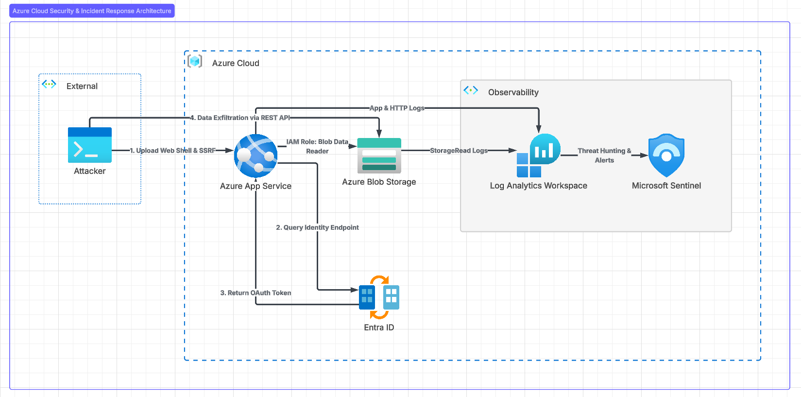

The environment consists of:
*   **Vulnerable Workload:** Azure App Service (PHP 8.2)
*   **Identity Management:** Azure Entra ID (Managed Identity)
*   **Target Data:** Azure Blob Storage
*   **Security Operations:** Log Analytics Workspace & Microsoft Sentinel

---

## ⚔️ Phase 1: Red Team Operations (The Attack)

### 1. Initial Access & Execution
A PHP web shell (`resume.php`) was successfully uploaded bypassing client-side validation on the `careers.php` portal. 
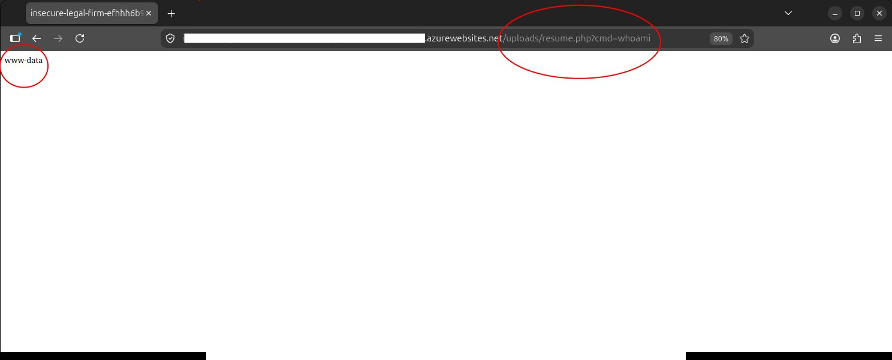

### 2. Credential Access via SSRF
Utilizing the web shell, an SSRF attack was executed against the local Azure container environment to query the `$IDENTITY_ENDPOINT`. This successfully extracted the OAuth Bearer token for the App Service's Managed Identity.
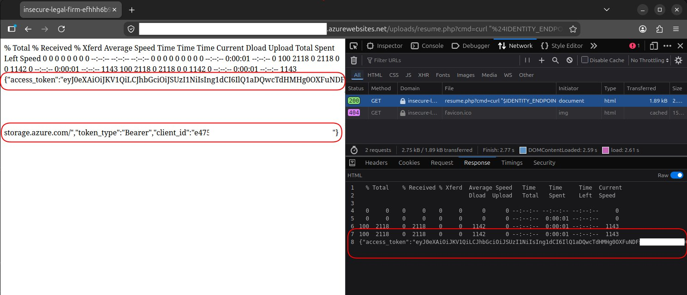

### 3. Discovery & Exfiltration
With the stolen token, the Azure Storage REST API was enumerated from an external terminal. The sensitive file `whistleblower_testimony.txt` was located and successfully exfiltrated.
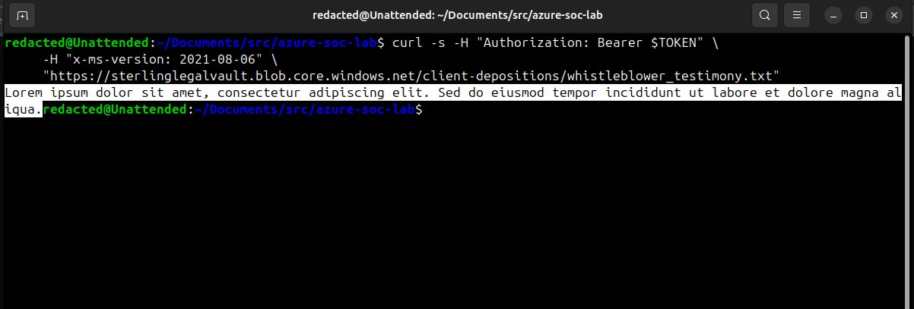

---

## 🛡️ Phase 2: Blue Team Operations (SOC & Threat Hunting)

### 1. Detecting the Payload (App Service Logs)
Using KQL, custom application logs were queried to identify the exact timestamp and IP address associated with the malicious file upload.
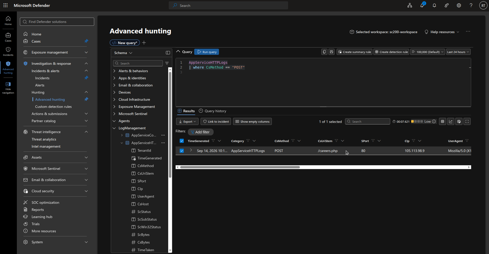

### 2. Tracing the SSRF Pivot (HTTP Logs)
HTTP request logs revealed the exact URL-encoded `curl` commands passed to the web shell, confirming the attacker queried the Identity Endpoint.
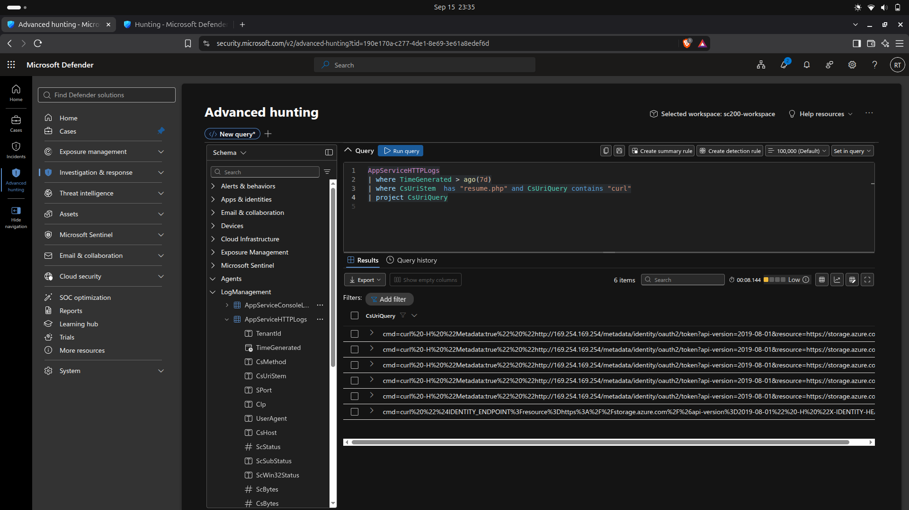

### 3. Confirming Data Loss (Storage Logs)
Storage blob telemetry confirmed an anomalous `GetBlob` operation. The logs proved the OAuth token was used from an external IP address (the attacker's machine) rather than the internal Azure VNet.
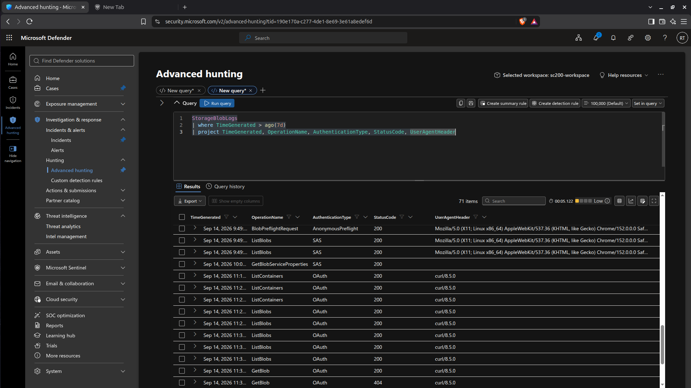

---

## 🔧 Phase 3: Cloud Security & Remediation

To harden the environment and prevent recurrence, the following architecture changes are recommended:

*   **Network Isolation:** Implement Azure Private Endpoints for the Storage Account, ensuring it only accepts traffic originating directly from the App Service Virtual Network (VNet), neutralizing external token use.
*   **Strict IAM Scoping:** Adhere to the Principle of Least Privilege (PoLP) by ensuring the Managed Identity's "Storage Blob Data Reader" role is scoped strictly to the required container, not the entire storage account.
*   **Application Hardening:** Rewrite the upload functionality to enforce strict server-side MIME-type validation, randomize filenames, and store uploads in an isolated, non-executable directory.
*   **Detection Engineering:** Deploy automated Microsoft Sentinel Analytic Rules to trigger high-severity alerts whenever an OAuth-authenticated `StorageRead` event originates from an IP address outside the known corporate NAT gateway.

---

## 🛠️ Phase 4: Detection Engineering & Incident Response

To close the loop on this incident, custom detection rules were engineered, automated SOAR playbooks were deployed, and immediate remediation steps were applied to the cloud infrastructure.

### 1. Microsoft Sentinel Analytic Rule Creation
A scheduled KQL query was deployed in Microsoft Sentinel to automatically trigger a High-Severity incident if a `StorageRead` event occurs via OAuth authentication where the Source IP does not match the known Azure App Service outbound IPs. The rule was mapped to **Initial Access**, **Credential Access**, and **Exfiltration** MITRE tactics.
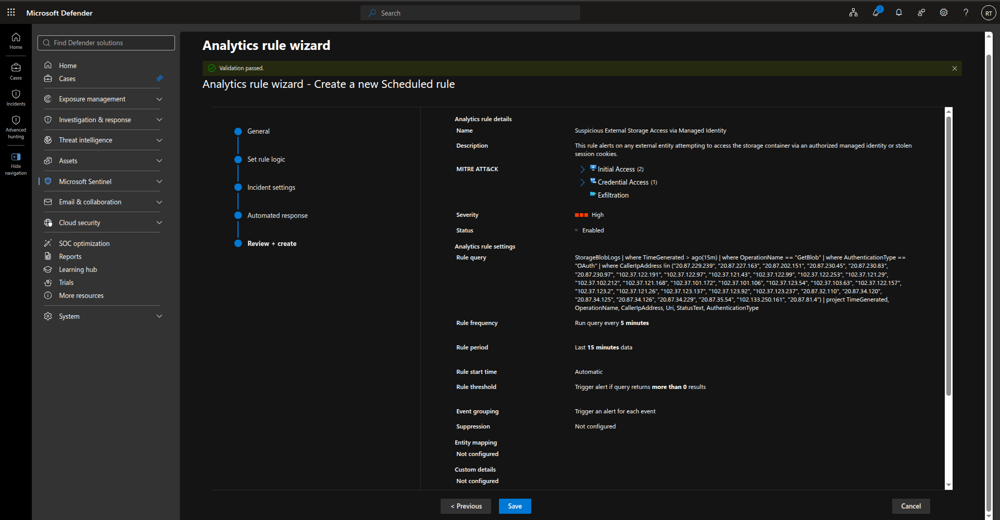

### 2. SOAR & Incident Routing
To reduce Mean Time to Acknowledge (MTTA), a Sentinel Automation Rule was configured. Upon generation of the exfiltration alert, the incident is instantly routed and assigned to a designated SOC Analyst for immediate triage.
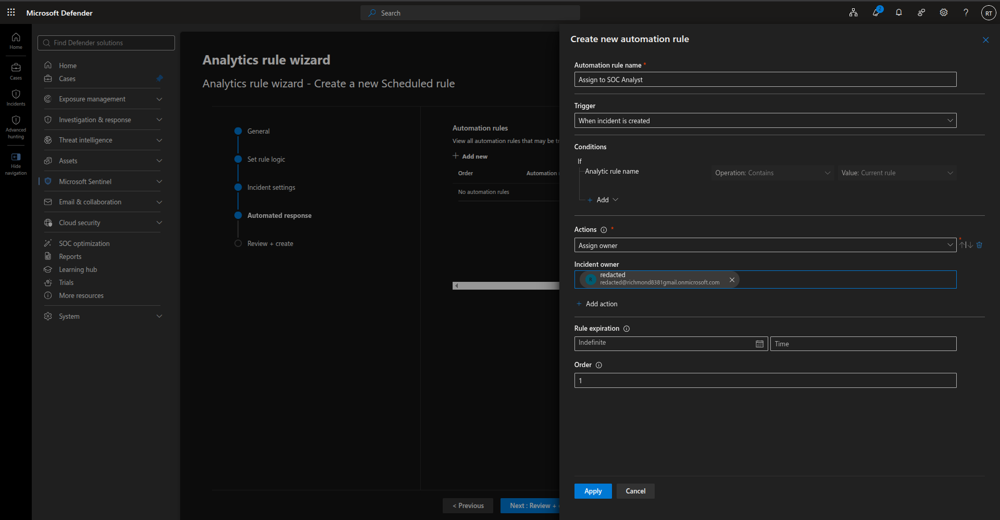

### 3. Incident Trigger & Triage
To validate the detection pipeline, the data exfiltration command was re-executed. Sentinel successfully correlated the telemetry, fired the analytic rule, and automatically assigned the resulting incident. 
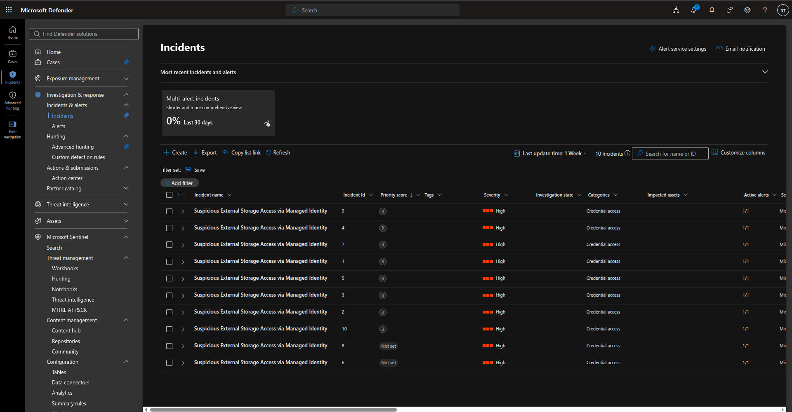

The expanded alert details confirm the exact payload, the external IP address used, and the stolen identity.
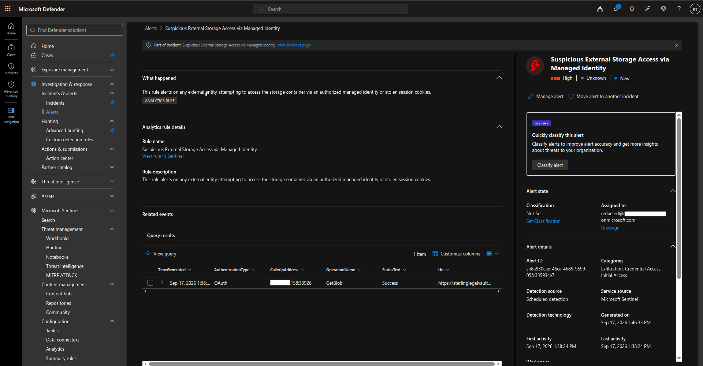

### 4. Network Firewall Remediation
To simulate an immediate incident response action without VNet integration, the Storage Account's public access was restricted. The native Azure firewall was configured to explicitly deny all external traffic, whitelisting only the Outbound IP addresses of the App Service.
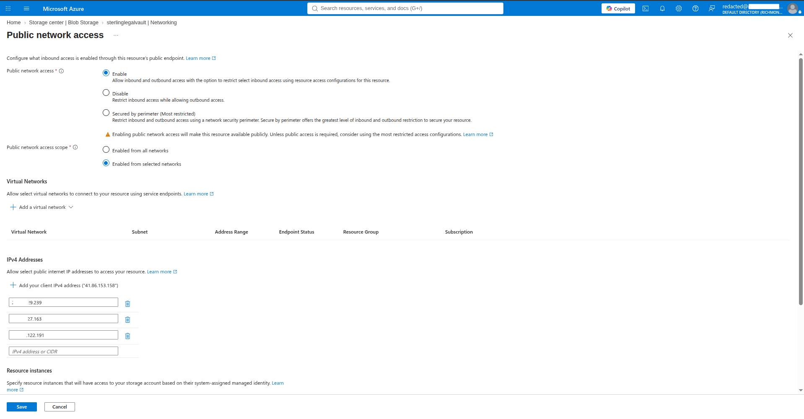

### 5. Verifying the Mitigation
To confirm the vulnerability was neutralized, the original data exfiltration command was re-executed from the external terminal using a freshly generated, valid OAuth token. The request was successfully blocked at the network edge, returning a `403 AuthorizationFailure` error, proving the effectiveness of the IP restriction.
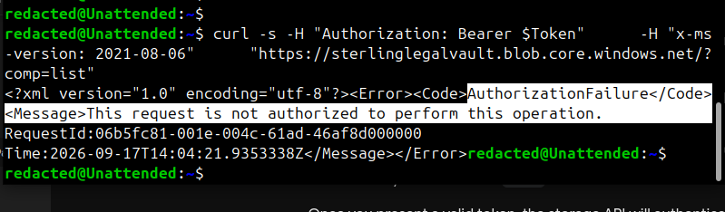

---

### Contact
For collaborations or questions related to this project, please feel free to reach me via:

* X (formerly twitter): [@thatboringbro](https://x.com/thatboringbro)
* LinkedIn: [Gbolahanv Joel Adeoye](https://www.linkedin.com/in/gbolahan-joel-adeoye-0551bb2a1/)
